# Lab04-ARSW

## Elaborado por:
- **Santiago Córdoba Dueñas**
- **Santiago Silva Roa**

---

## Parte 1

### 3. Inyección de dependencias en `EnglishSpellChecker` y `SpanishSpellChecker`
Se aplicaron las correspondientes inyecciones de dependencia en `EnglishSpellChecker` y `SpanishSpellChecker`:

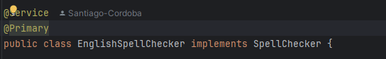

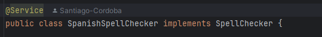

> **Nota:** Con `@Primary`, se indica que el `bean` con prioridad es `EnglishSpellChecker`.

### 4. Salida en consola con `EnglishSpellChecker`
A continuación, se muestra la salida en consola al usar `EnglishSpellChecker`:

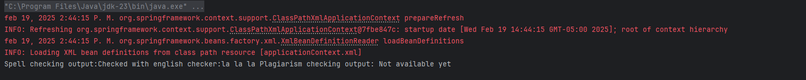

### 5. Cambios para usar `SpanishSpellChecker`
Para ejecutar el `bean` de `SpanishSpellChecker`, se deben realizar los siguientes cambios:
- Retirar `@Primary` de `EnglishSpellChecker`.
- Asignar `@Primary` a `SpanishSpellChecker`.

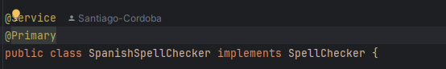

Una vez realizado el cambio, se puede verificar la ejecución de `SpanishSpellChecker`:

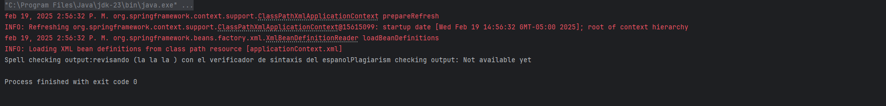

---

## Parte 2

### 1. Configuración del `pom.xml` y `applicationContext`
Se realizó la configuración necesaria en el `pom.xml` y se añadió el `applicationContext`.

#### `pom.xml`
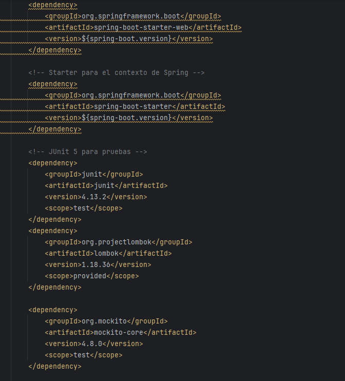
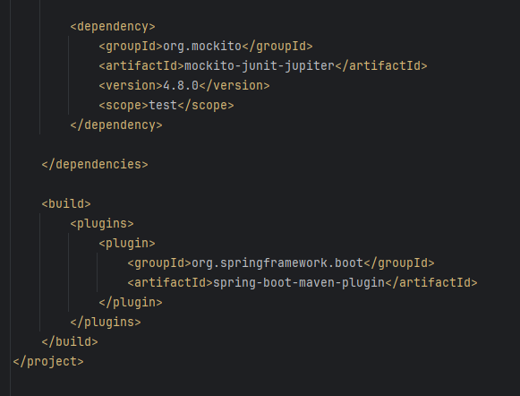

#### `applicationContext`
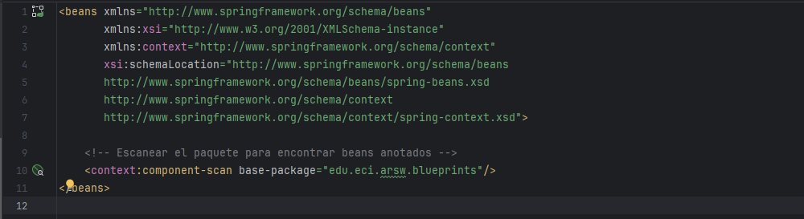

---

### 2. Implementación de métodos `getBluePrint()` y `getBlueprintsByAuthor()`
Se implementaron los métodos necesarios en `BlueprintServices`:

```java
public Blueprint getBlueprint(String author, String name) throws BlueprintNotFoundException {
    return bpp.getBlueprint(author, name);
}

/**
 * Obtiene todos los blueprints de un autor específico.
 *
 * @param author Autor del blueprint.
 * @return Conjunto de blueprints del autor dado.
 * @throws BlueprintNotFoundException si el autor no existe.
 */
public Set<Blueprint> getBlueprintsByAuthor(String author) throws BlueprintNotFoundException, BlueprintPersistenceException {
    return bpp.getBlueprintsByAuthor(author);
}
```

3. Para este punto añadiremos el controlador correspondiente y el application.properties para poder consumir la API 

```java
@RestController
@RequestMapping("/blueprints")
public class BlueprintsController {

    @Autowired
    private BlueprintsServices blueprintServices;


    @PostMapping
    public ResponseEntity<?> addNewBlueprint(@RequestBody Blueprint blueprint) {
        try {
            blueprintServices.addNewBlueprint(blueprint);
            return ResponseEntity.status(201).build();
        } catch (Exception e) {
            return ResponseEntity.badRequest().body("Error al agregar el blueprint: " + e.getMessage());
        }
    }


    @GetMapping
    public ResponseEntity<?> getAllBlueprints() throws BlueprintPersistenceException {
        Set<Blueprint> blueprints = blueprintServices.getAllBlueprints();
        if (blueprints == null || blueprints.isEmpty()) {
            return ResponseEntity.noContent().build();
        }
        return ResponseEntity.ok(blueprints);
    }


    @GetMapping("/{author}/{name}")
    public ResponseEntity<?> getBlueprint(@PathVariable String author, @PathVariable String name) {
        try {
            Blueprint blueprint = blueprintServices.getBlueprint(author, name);
            return ResponseEntity.ok(blueprint);
        } catch (BlueprintNotFoundException e) {
            return ResponseEntity.notFound().build();
        }
    }


    @GetMapping("/{author}")
    public ResponseEntity<?> getBlueprintsByAuthor(@PathVariable String author) {
        try {
            Set<Blueprint> blueprints = blueprintServices.getBlueprintsByAuthor(author);
            return ResponseEntity.ok(blueprints);
        } catch (BlueprintNotFoundException | BlueprintPersistenceException e) {
            return ResponseEntity.status(404).body("No se encontraron blueprints para el autor: " + author);
        }
    }
```

```java
server.port=8080
```

Ahora procederemos a consumir la API con Postman paraa poder ver el respectivo funcionamiento de cada endpoint

Primero probamos el endPoint para poder crear Blueprints y procedemos a ingresar los sigueintes:

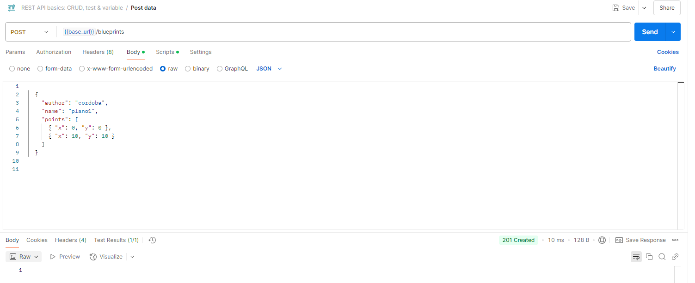

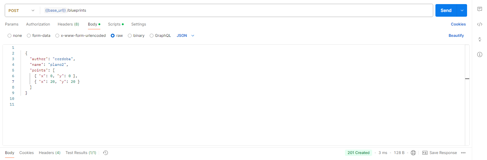

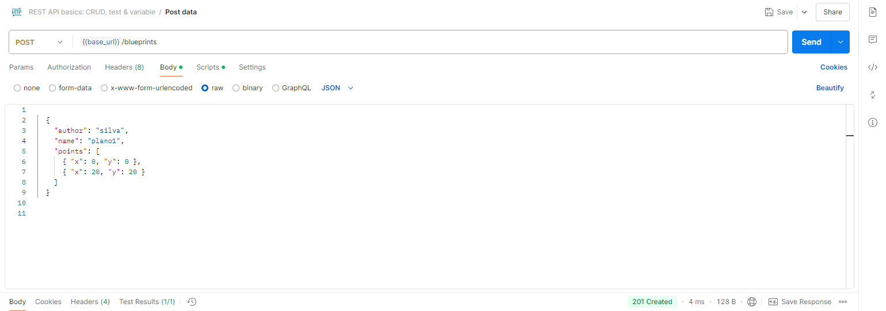

Ahora consumimos el endPoint de getAllBluePrints

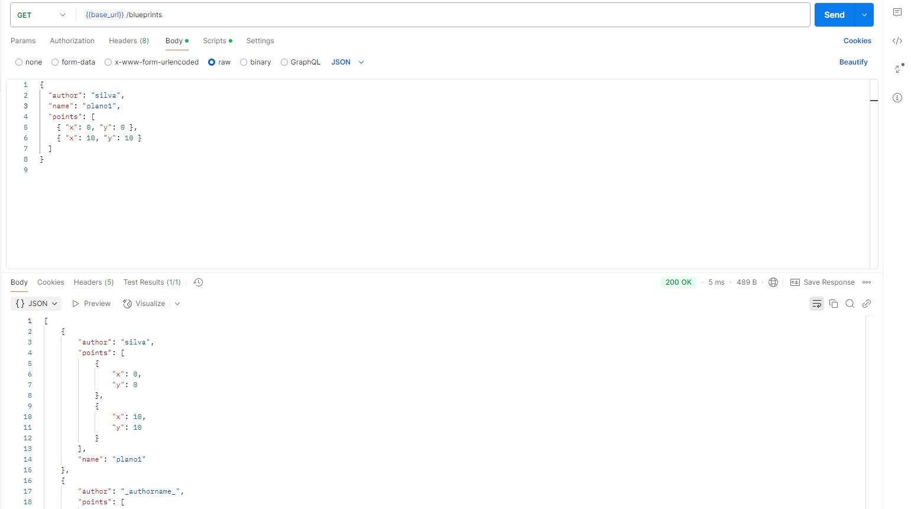

Continuamos con el endPoint de getBlueprintsByAuthor()

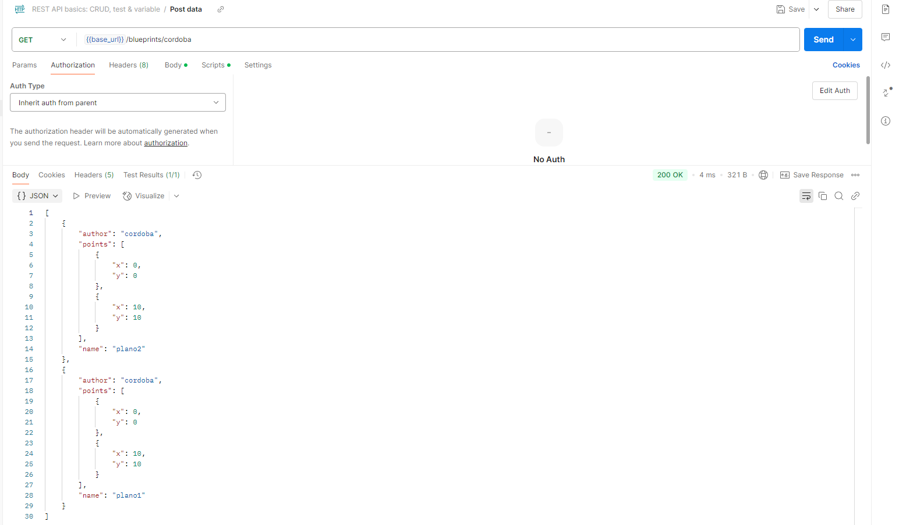

Finalizamos con el endPoint de getBluePrint()

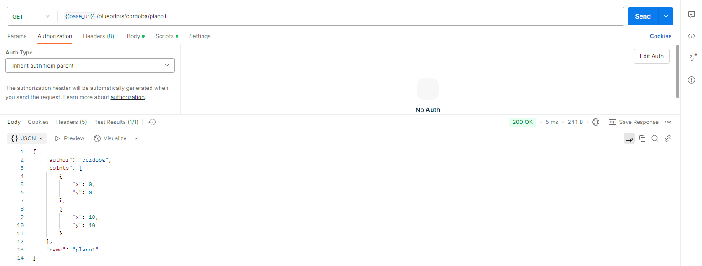

4. Se crea una interfaz para el manejo de los distintos filtros y se implementan los dos filtros que se piden.
ademas de que se implementan el uso de los filtros a los servicios.
```java
package edu.eci.arsw.blueprints.filter;

import edu.eci.arsw.blueprints.model.Blueprint;

public interface BluePrintFilter {
    Blueprint filter(Blueprint blueprint);
}

```

```java
@Component
@Primary
public class RedundancyFilter implements BluePrintFilter {
    @Override
    public Blueprint filter(Blueprint blueprint) {
        List<Point> filteredPoints = new ArrayList<>();
        List<Point> originalPoints = blueprint.getPoints();

        if (!originalPoints.isEmpty()) {
            filteredPoints.add(originalPoints.get(0)); 
            for (int i = 1; i < originalPoints.size(); i++) {
                Point current = originalPoints.get(i);
                Point lastAdded = filteredPoints.get(filteredPoints.size() - 1);

                if (current.getX() != lastAdded.getX() || current.getY() != lastAdded.getY()) {
                    filteredPoints.add(current);
                }
            }
        }

        blueprint.setPoints(filteredPoints);
        return blueprint;
    }
}
```

```java
@Component
public class SubsamplingFilter implements BluePrintFilter {
    @Override
    public Blueprint filter(Blueprint blueprint) {
        List<Point> originalPoints = blueprint.getPoints();
        List<Point> subsamplingPoints = new ArrayList<>();

        for (int i = 0; i < originalPoints.size(); i++) {
            if (i % 2 == 0) { 
                subsamplingPoints.add(originalPoints.get(i));
            }
        }

        blueprint.setPoints(subsamplingPoints);
        return blueprint;
    }
}
```

5. Consumiremos otra vez los endPoints para ver el funcionamiento de los endPoints con los filtros, además de que se añadieron las respectivas pruebas unitarias.

-Filtro de redundancia:


-Filtro de submuestreo:

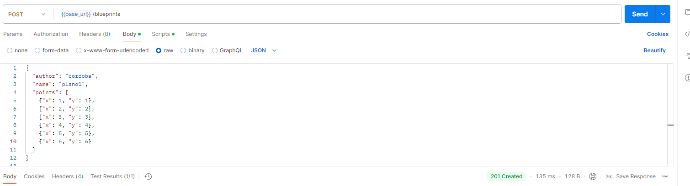

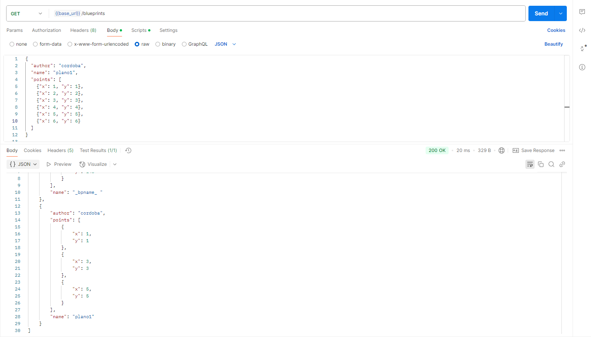